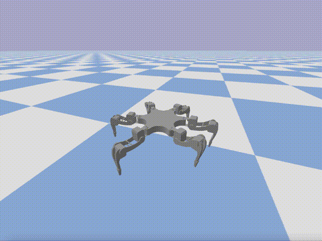

# RARL Hexapod Simulator

  

A dynamical simulation of the RARL Hexapod platform using the [PyBullet](https://pybullet.org/wordpress/) physics engine.
This is a forked project that has been altered and added to, in order work with a central pattern generator (CPG) controller.
It was done for my honours project. 

**Please read the research paper for more details**

# Dependencies
- pybullet
- numpy
- matplotlib
- scipy

Run `python3 example.py` to see a sample simulation. 

*NOTE: This repo is just a supporting repo for the [main project repo](https://github.com/DavidBlore/honours-project-hexapod)
